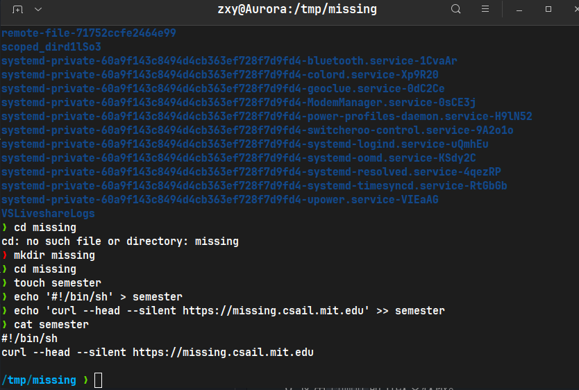
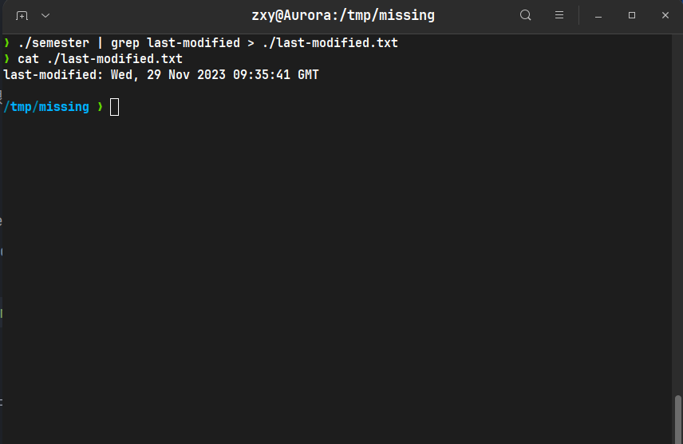
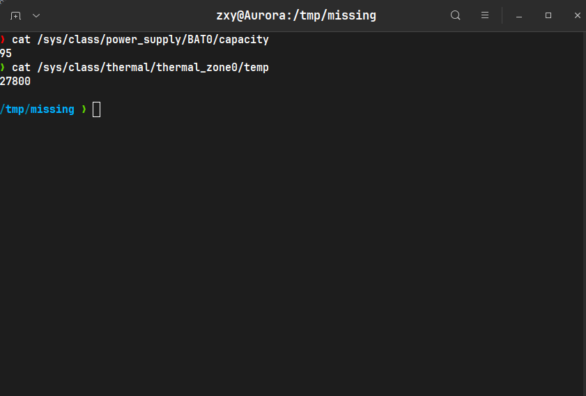

1. 查看当前shell环境
```shell
echo $SHELL
```
2. 在 `/tmp`下新建一个名为 missing 的文件夹。
```shell
cd /tmp
mkdir missing
cd missing
```

3. 用 `man` 查看程序 touch 的使用手册。
```shell
man touch
```
4. 用 `touch` 命令在 missing 文件夹下创建一个名为 semester 的空文件。
```shell
touch semester
```
5. 将以下内容一行一行地写入 semester 文件：
```shell
 #!/bin/sh
 curl --head --silent https://missing.csail.mit.edu
```
```shell
echo '#!/bin/sh' > semester  # 单引号内的内容不会被解释执行，是字符字面量
echo 'curl --head --silent https://missing.csail.mit.edu' >> semester
```
  

6. 尝试执行这个文件。
7. 查看chmod的手册。
8. 使用`chmod`命令改变权限。
```shell
chmod 711 semester
```
9.  使用`|`和`>`，将 semester 文件输出的最后更改日期信息，写入主目录下的 last-modified.txt 的文件中。
```shell
./semester | grep last-modified > ./last-modified.txt
```
  

10.  写一段命令来从 /sys 中获取笔记本的电量信息，或者台式机 CPU 的温度。
```shell
cat /sys/class/power_supply/BAT0/capacity  # 获取笔记本电池电量
cat /sys/class/thermal/thermal_zone0/temp  # 获取CPU温度
```
  
